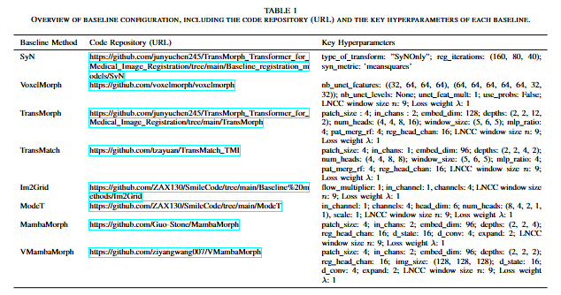

## The implementation of paper "HCMReg: A Pyramid Network with Hybrid Encoder and Cross Mamba Fusion for Unsupervised Medical Image Registration"

---
## Baseline Configuration
All baseline training settings remain consistent and are configured as follows:
Max Epoch: 500; Early Stopping: Patience=10 (monitored on val DSC); Optimizer: AdamW (lr=0.001, weight\_decay=0, amsgrad=True); Batch size: 1.
In our actual experiments, we adopted the baseline code implementation with some refinements and dataset adaptations.

