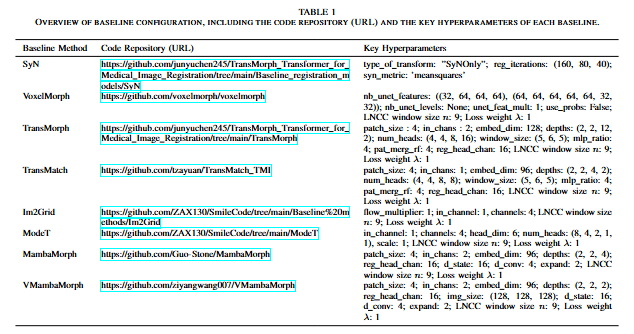

# HCMReg: A Pyramid Network with Hybrid Encoder and Cross Mamba Fusion for Unsupervised Medical Image Registration

## Overview

HCMReg is a pyramid network for unsupervised 3D medical image registration, refactored from MambaFusev6. It uses a hybrid encoder (convolutional + Mamba SSM) and cross-mamba fusion decoder for deformable image registration.

## Project Structure

```
HCMReg/
├── model/                    # Core model definitions
│   ├── HCMReg.py            # Main pyramid registration model
│   ├── HybridEnc.py         # Hybrid encoder (Conv + Mamba + ELK)
│   ├── CrossMambaFusion.py  # Cross-Mamba SSM fusion decoder
│   └── func.py              # SpatialTransformer, VecInt, ResizeTransform
├── data/                     # Dataset and transform utilities
│   ├── datasets.py          # BrainDataset (A2S, S2S variants)
│   └── trans.py             # Image transforms and augmentations
├── baselines/                # Baseline methods for comparison
│   ├── VoxelMorph/          # CNN-based registration
│   ├── TransMorph/          # Transformer-based registration
│   ├── TransMatch/          # Transformer matching
│   ├── MambaMorph/          # Mamba-based registration
│   ├── ModeTs/              # ModeT registration
│   └── SyN/                 # Classical SyN (ANTs)
├── losses.py                 # Loss functions (NCC, Grad, Jacobian, Dice)
├── utils.py                  # Metrics, spatial transformer, weight utilities
├── config.py                 # Centralized dataset configurations
├── train_common.py           # Shared training logic
├── infer_common.py           # Shared inference/evaluation logic
├── convert_weights.py        # MambaFusev6 -> HCMReg weight conversion
├── weights/                  # Pretrained weights directory
│   ├── LPBA40/              # LPBA40 pretrained (DSC 0.732)
│   ├── IXI/                 # IXI pretrained (DSC 0.769)
│   └── MindBoggle/          # MindBoggle pretrained (DSC 0.637)
└── requirements.txt          # Python dependencies
```

## Supported Datasets

| Dataset | Type | Image Size | Description |
|---------|------|------------|-------------|
| LPBA40 | Atlas-to-Subject | 160×192×160 | 40 brain MRIs, 56 ROIs |
| IXI | Atlas-to-Subject | 160×192×224 | 30 FreeSurfer labels |
| MindBoggle | Subject-to-Subject | 160×192×160 | 62 ROIs |
| OASIS | Subject-to-Subject | 224×192×160 | 35 ROIs |

## Quick Start

### Installation

```bash
pip install -r requirements.txt
```

Dependencies: PyTorch, SimpleITK, mamba-ssm, causal-conv1d, wandb, medpy, pystrum, thop, natsort

### Inference with Pretrained Weights

```bash
# Convert MambaFusev6 weights to HCMReg format
python convert_weights.py --all

# Run inference
python infer_LPBA.py       # LPBA40 (DSC ~0.732)
python infer_IXI.py         # IXI (DSC ~0.769)
python infer_MB.py           # MindBoggle (DSC ~0.637)
python infer_OASIS.py       # OASIS (no pretrained weights yet)
```

### Training

```bash
python train_LPBA.py        # Train on LPBA40 (GPU 3)
python train_IXI.py         # Train on IXI (GPU 3)
python train_MB.py          # Train on MindBoggle (GPU 2)
python train_OASIS.py       # Train on OASIS (GPU 1)
```

Edit `config.py` to adjust hyperparameters (learning rate, loss weights, image size, etc.).

### Converting Pretrained Weights

```bash
# Convert all available MambaFusev6 checkpoints
python convert_weights.py --all

# Convert a specific dataset
python convert_weights.py --dataset LPBA40
```

## Baseline Configuration

All baseline training settings remain consistent and are configured as follows:
Max Epoch: 500; Early Stopping: Patience=10 (monitored on val DSC); Optimizer: AdamW (lr=0.001, weight_decay=0, amsgrad=True); Batch size: 1.

In our actual experiments, we adopted the baseline code implementation with some refinements and dataset adaptations.


